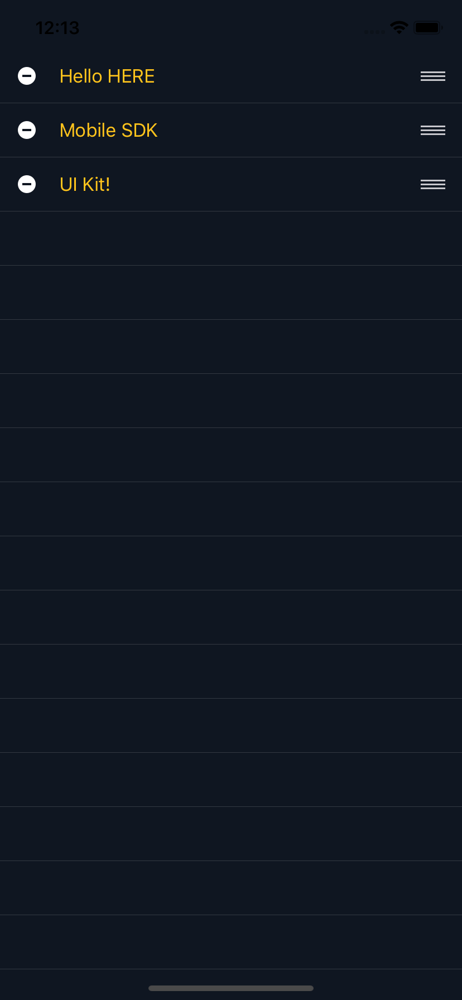

# Quick Start

Thank you for using the HERE Mobile SDK UI Kit (MSDKUI). In this Quick Start guide, we are going to introduce you to the HERE Mobile SDK UI Kit (MSDKUI) and show you how easy it is to get started. As a very first example, we'll also develop a "Hello HERE Mobile SDK UI Kit" iOS application as part of this guide. For more examples and in-depth information on how to work with the HERE Mobile SDK UI Kit (MSDKUI) framework, please refer to the [User Guide](UserGuide.md).

## Contents

- [Quick Start](#quick-start)
  - [Contents](#contents)
  - [How to run the example apps](#how-to-run-the-example-apps)
  - [How to run the Demo app](#how-to-run-the-demo-app)
  - [Set up an Xcode iOS Project](#set-up-an-xcode-ios-project)
    - [Integrate the HERE Mobile SDK and the HERE Mobile SDK UI Kit (MSDKUI)](#integrate-the-here-mobile-sdk-and-the-here-mobile-sdk-ui-kit-msdkui)
      - [What to do if you have already included the HERE Mobile SDK in an existing project?](#what-to-do-if-you-have-already-included-the-here-mobile-sdk-in-an-existing-project)
      - [Can I integrate the HERE Mobile SDK UI Kit (MSDKUI) manually without CocoaPods?](#can-i-integrate-the-here-mobile-sdk-ui-kit-msdkui-manually-without-cocoapods)
    - [Set your HERE Mobile SDK credentials](#set-your-here-mobile-sdk-credentials)
    - [Add your first HERE Mobile SDK UI Kit (MSDKUI) component](#add-your-first-here-mobile-sdk-ui-kit-msdkui-component)

## How to run the example apps

If you want to try out the accompanying example apps, perform the following steps:

- Prerequirement: If you are new to CocoaPods or need to install it via Terminal, please follow the steps as described [here](https://guides.cocoapods.org/using/getting-started.html).
- Navigate to an example, for example: _msdkui-ios/Documentation/Guides_Examples/HelloMSDKUI_. In the example's root folder (where the Podfile is located) run via Terminal `pod install --repo-update` to fetch and to integrate the HERE Mobile SDK for iOS _and_ the MSDKUI framework.
- Set your HERE SDK for iOS (Premium Edition) credentials in `AppDelegate.swift`:

```swift
let appId = "YOUR_APP_ID"
let appCode = "YOUR_APP_CODE"
let licenseKey = "YOUR_LICENSE_KEY"
```

- Make sure to adapt the `Bundle Identifier` appropriately to match with your credentials.
- Open the `*.xcworkspace` (NOT `*.xcodeproj`)
- For more information on how to set up a new project, please, refer to our guide below which contains much more useful information on how to use the example apps.

## How to run the Demo app

Along with the accompanying example apps and code snippets, we also provide a more complex demo app showing a complete and fully functional flow. If you want to try out the Demo application, please take a look at the [Contribution Guide](ContributionGuide.md).

If you want to build your own app, it may be useful to follow the guide below where we will develop step by step a first "Hello HERE Mobile SDK UI Kit" app in greater detail.

## Set up an Xcode iOS Project

Let's start by creating a new iOS app. If you want to integrate the HERE Mobile SDK UI Kit (MSDKUI) into an existing app, you can skip the step below, but please make sure to meet the [minimum requirements](../../README.md#ios-environment).
If you are new to iOS development please follow the guides on [developer.apple.com](https://developer.apple.com/documentation/) to help you to get started with the first steps.

>The example project is called "HelloMSDKUI" and it can be found [here](../Guides_Examples).

For this Quick Start app, we have used Xcode 12.4 and Swift 5.3.3 Start Xcode and select:

- _Create a new Xcode project_.
- As template, it is sufficient to choose _iOS_ => _Application_ => _Single View App_.
- Provide a project name, e.g. "HelloMSDKUI" and select _Swift_ as language.
- Set a bundle identifier matching the one you have used to acquire your HERE credentials, e.g. "com.here.msdkui.example".
- After Xcode has prepared the project setup, make sure to set up your provisioning profile: _Project settings_ => _Signing_ or enable _Automatically manage signing_.
- Make sure your application's _Deployment Target_ is higher or equal to the [minimum supported version](../../README.md#ios-environment) of the HERE Mobile SDK UI Kit (MSDKUI). It should match the iOS version you have set in your podfile (see below).
- Select a simulator, e.g. iPhone 8, or a real device (recommended).
- We keep default orientation settings.

Now _build and run the current scheme_ and verify that your project executes as expected. If all goes well, you should see blank view without any content.

While all of the functionality of the HERE Mobile SDK UI Kit (MSDKUI) is accessible from the simulator, usage of a real device is strongly recommended. The overall performance will be better, and some features like gestures are just easier to use on multi-touch-enabled hardware.

### Integrate the HERE Mobile SDK and the HERE Mobile SDK UI Kit (MSDKUI)

You can integrate the SDK and the framework manually or via CocoaPods. More details on integrating the HERE Mobile SDK can be found on [developer.here.com](https://developer.here.com/documentation/ios-premium/topics/app-simple-swift.html).

With the full support of the CocoaPods dependency manager, you don't have to download and integrate the HERE Mobile SDK package and the HERE Mobile SDK UI Kit (MSDKUI) manually. If you are new to CocoaPods or need to install it via Terminal, please follow the steps as described on [guides.cocoapods.org](https://guides.cocoapods.org/using/getting-started.html). Make sure to use the [minimum supported version](../../README.md#ios-environment).

To run CocoaPods, please close Xcode and create a new "Podfile" in your project's root folder:

```ruby
target 'HelloMSDKUI' do
    platform :ios, '12.0'
    pod 'HEREMapsUI', '2.1.8'
end
```

- The `target` specifies your project's name (which is "HelloMSDKUI" in the above example).
- Make sure to set the version number for `HEREMapsUI` to a version we have published via CocoaPods.

>**Note:** If you have forked or if you want to use the latest development branch, you can instead point to the local MSDKUI.podspec. For example, if your project lives in the same folder as the example apps, this would be: `pod 'HEREMapsUI', :path => '../../../'`.

The podspec for MSDKUI already includes the dependency to the HERE Mobile SDK and the SDK will be automatically fetched and integrated into your app by CocoaPods. The HERE Mobile SDK version will be the one that MSDKUI has specified on its [podspec](https://cocoapods.org/pods/HEREMapsUI).

To include the required dependencies, please perform the following steps:

- Open the terminal and navigate to your project folder to execute: `pod install --repo-update`. This will fetch and integrate the HERE Mobile SDK and the HERE Mobile SDK UI Kit (MSDKUI) to your project.
- Once done, please open the newly generated `*.xcworkspace` Xcode project file (do NOT open `*.xcodeproj`).

> If you are getting an error that MSDKUI.modulemap or NMAKit is not found, please make sure to use the latest supported [Cocoapods version](../../README.md#ios-environment). You may need to remove all traces from previous pods by executing `pod deintegrate`. Once done, you can install the pods again.

#### What to do if you have already included the HERE Mobile SDK in an existing project?

If you have already included the HERE Mobile SDK via CocoaPods, then the related dependency (`pod 'HEREMaps’, ‘x.x’`) can be removed from your Podfile. If you used a different SDK version, please make sure that your app is compatible with the [SDK version](../../README.md#supported-platforms) required by the MSDKUI library. If you had the SDK integrated _manually_, please deintegrate it before installing the pods.

#### Can I integrate the HERE Mobile SDK UI Kit (MSDKUI) manually without CocoaPods?

Yes, you can. Using CocoaPods is recommended, but if you prefer to build the framework manually, you can integrate the binary similar like adding any other framework to your project.

As a first step, please build the HERE Mobile SDK UI Kit (MSDKUI) framework. This can be done using a simple `rake` command from your _Terminal_. Please see our [Contribution Guide](ContributionGuide.md) for details.

>If you plan to add all dependencies manually, it may be useful to run `pod deintegrate` from the Terminal to clean the project from any pending CocoaPods traces.

1. Copy the resulting `MSDKUI.framework` file to your app's root folder.
2. In Xcode, open the _General_ settings of the _App_ target and add the `MSDKUI.framework` to the _Embedded Binaries_ section ("Add other..." -> "Create folder references")

Make sure the HERE Mobile SDK UI Kit (MSDKUI) framework also appears below in the section _Linked Frameworks and Libraries_. Same steps apply, when you plan to download and integrate the HERE Mobile SDK fo iOS manually. You can download the HERE Mobile SDK for iOS package from [developer.here.com](http://developer.here.com). Please read this [tutorial](https://developer.here.com/documentation/ios-premium/topics/app-create-simple.html) for more information.

>If you integrate the MSDKUI library manually into an existing project, please make sure, that your app is compatible with the [HERE Mobile SDK version](../../README.md#supported-platforms) required by the MSDKUI library. If you are using a different SDK version, please update your app to use the required version.

### Set your HERE Mobile SDK credentials

The HERE Mobile SDK (Premium Edition) must be authenticated by providing a set of credentials specific for your project. If you don't know your credentials, please ask your HERE stakeholder or register on [developer.here.com](https://developer.here.com) and create new ones.

The HERE Mobile SDK initialization cannot be performed multiple times - only once - and has to be done before the first NMA call. The common place for that would be in the `AppDelegate`'s `application(_ application:didFinishLaunchingWithOptions:)`-callback, but can be done from a different place, if you prefer. For this example, we are setting app id, app code and license key from within the `AppDelegate`, like shown in the code snippet below:

```swift
// Set credentials (based on bundle identifier)
let appId = "YOUR_APP_ID"
let appCode = "YOUR_APP_CODE"
let licenseKey = "YOUR_LICENSE_KEY"
NMAApplicationContext.setAppId(appId, appCode: appCode, licenseKey: licenseKey)
```

>If you want to try out our fully functional demo app or one of the [examples](../Guides_Examples), please, make sure to adapt the bundle identifier to match exactly the one you provided when you requested your credentials on [developer.here.com](https://developer.here.com).

Make sure to add `import NMAKit` and `import MSDKUI` at the top of the file to make sure the HERE Mobile SDK and the HERE Mobile SDK UI Kit (MSDKUI) are known to your class.

Now it is time to test that everything is set up correctly by printing a "Hello" message with the help of the HERE Mobile SDK UI Kit (MSDKUI).

### Add your first HERE Mobile SDK UI Kit (MSDKUI) component

Once we have the HERE SDK _and_ the HERE Mobile SDK UI Kit (MSDKUI) available in our project, we open the main view controller Xcode has created for us, i.e. `ViewController.swift`, and add the following imports to include the HERE Mobile SDK and the HERE Mobile SDK UI Kit (MSDKUI):

```swift
import UIKit
import NMAKit
import MSDKUI
```

In the `viewDidLoad()` method, add the following code to add a `WaypointList` component programmatically:

```swift
let waypointList = WaypointList(frame: view.bounds)
view.addSubview(waypointList)
```

A `WaypointList` is a HERE Mobile SDK UI Kit (MSDKUI) component containing items describing waypoints for which a route can be calculated. We initialize the `WaypointList` by giving it the same size as the parent view and then adding it as a subview. Since WaypointList is a child of `UITableView`, it behaves like you would expect from any other `UIView`.

Usually, you want to initialize HERE Mobile SDK UI Kit (MSDKUI) components from a storyboard, but all components support both ways. For this Quick Start guide, we only want to see a quick proof how seamless the HERE Mobile SDK UI Kit (MSDKUI) can be incorporated into your app.

Now it's time to build and run the app. If all goes well, you should see a `WaypointList` with default content covering the whole area of the view.

As you know from the HERE Mobile SDK, it is easy to create waypoints for route calculation. First, create a set of `NMAGeoCoordinates` and pass them into the initializer for `NMAWaypoint`:

```swift
let waypoint = NMAWaypoint(geoCoordinates: NMAGeoCoordinates(latitude: 52, longitude: 13))
let startWaypointEntry = WaypointEntry(waypoint)
let stopoverWaypointEntry = WaypointEntry(waypoint)
let destinationWaypointEntry = WaypointEntry(waypoint)
```

For this tutorial, we only want to populate the `WaypointList` with the waypoints, so we choose the same coordinates for all three waypoints. Note that a `WaypointList` can hold an unlimited number of stopovers, where the first waypoint marks the start of the route, while the last waypoint marks the destination of the route.

In order to show the obligatory "Hello World", we give the coordinates a name like:

```swift
startWaypointEntry.name = "Hello HERE"
stopoverWaypointEntry.name = "Mobile SDK"
destinationWaypointEntry.name = "UI Kit!"
```

In a real application, you most likely want to provide reverse geocoded addresses. Setting the `NMAWaypoints` is easy:

```swift
waypointList.waypointEntries = [startWaypointEntry,
                                stopoverWaypointEntry,
                                destinationWaypointEntry]
```

The order in the array defines the order of how the waypoints shall appear in the `WaypointList`. However, the component also allows to interactively shuffle the waypoints around, using the right-hand drag handles - or do delete waypoints by tapping the _minus_ buttons on the left side.

Lastly, we add the following line:

```swift
waypointList.itemTextColor = UIColor(red: 1.0, green: 0.77, blue: 0.11, alpha: 1.0)
```

By accessing the `waypointList` properties we can easily make adjustments to this HERE Mobile SDK UI Kit (MSDKUI) component and customize its look and feel on-the-fly. In this case, we change the default white-on-black text to appear colored.

<center><p>
  
</p></center>

As an example, look for other `waypointList`-styles, e.g. `.itemBackgroundColor`. What do you get?

The completed modifications to your `viewDidLoad()`-method should look like this:

```swift
override func viewDidLoad() {
    super.viewDidLoad()

    let waypointList = WaypointList(frame: view.bounds)
    view.addSubview(waypointList)

    let waypoint = NMAWaypoint(geoCoordinates: NMAGeoCoordinates(latitude: 52, longitude: 13))
    let startWaypointEntry = WaypointEntry(waypoint)
    let stopoverWaypointEntry = WaypointEntry(waypoint)
    let destinationWaypointEntry = WaypointEntry(waypoint)

    startWaypointEntry.name = "Hello HERE"
    stopoverWaypointEntry.name = "Mobile SDK"
    destinationWaypointEntry.name = "UI Kit!"

    waypointList.waypointEntries = [startWaypointEntry,
                                    stopoverWaypointEntry,
                                    destinationWaypointEntry]

    waypointList.itemTextColor = UIColor(red: 1.0, green: 0.77, blue: 0.11, alpha: 1.0)
}
```

Congratulations, you have just successfully mastered your first steps in using the HERE Mobile SDK UI Kit for iOS. If you want to see more examples and code snippets, please take a look at our [User Guide](UserGuide.md). Thank you!
