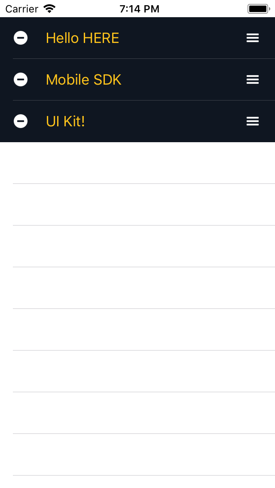

# Quick Start
Thank you for using the HERE Mobile SDK UI Kit. In this Quick Start guide, we are going to  introduce you to the UI Kit and show you how easy it is to get started. As a very first example, we shall develop a "Hello UI Kit" iOS application with Swift 4.1.

# Contents
<!-- TOC depthFrom:2 depthTo:6 withLinks:1 updateOnSave:1 orderedList:0 -->

- [Creating a new iOS Project](#creating-a-new-ios-project)
- [Integrating the HERE Mobile SDK for iOS](#integrating-the-here-mobile-sdk-for-ios)
	- [Setting your HERE SDK credentials](#setting-your-here-sdk-credentials)
- [Integrating the HERE Mobile SDK UI Kit for iOS](#integrating-the-here-mobile-sdk-ui-kit-for-ios)
- [Implementing Hello UI Kit](#implementing-hello-ui-kit)

<!-- /TOC -->


## Creating a new iOS Project

Let's start by creating a new iOS app. If you want to integrate the UI Kit into an existing app, you can skip this step. No HERE Mobile SDK or UI Kit specific code is involved here.
If you are new to iOS development please follow the guides on [developer.apple.com](https://developer.apple.com/documentation/) to help you to get started with the first steps.

>**Note:** The example code for "HelloUIKit" can be found in Documentation/User_Guide_Examples.

For this Quick Start app, we have used Xcode 9.4 and Swift 4.1. This is the minimum Xcode version you can use for development. Start Xcode and select:
- _Create a new Xcode project_
- As template, it is sufficient to choose _iOS_ => _Application_ => _Single View App_
- Provide a project name, e.g. "HelloUIKit" and select _Swift_ as language
- Set a bundle identifier matching the one you have used to acquire your HERE credentials, e.g. "com.here.msdkui.example"
- After Xcode has prepared the project setup, make sure to set up your provisioning profile: _Project settings_ => _Signing_ or enable _Automatically manage signing_
- Select a simulator, e.g. iPhone 8, or a real device (recommended)
- We keep default orientation settings
- Make sure _Deployment target_ is set to a version you have installed, the minimum supported version is iOS 10.0

Now _build and run the current scheme_ and verify that your project executes as expected. If all goes well, you should see blank view without any content.

While all of the functionality of the HERE UI Kit is accessible from the emulator, usage of a real device is strongly recommended. The overall performance will be better, and some features like gestures are just easier to use on multi-touch-enabled hardware.

## Integrating the HERE Mobile SDK for iOS
You can integrate the SDK manually or via CocoaPods. More details on integrating the HERE Mobile SDK can be found on [developer.here.com](https://developer.here.com/documentation/ios-premium/topics/app-simple-swift.html).

With the full support of the CocoaPods dependency manager, you don't have to download and integrate the HERE Mobile SDK package manually. If you are new to CocoaPods or need to install it via Terminal, please follow the steps as described on [guides.cocoapods.org](https://guides.cocoapods.org/using/getting-started.html).

To run CocoaPods, please close Xcode and create a new "Podfile" in your projects root folder:
```ruby
target 'HelloUI Kit' do
    platform :ios, '10.0'
    pod 'HEREMaps', '3.8'
end
```

As `target` please specify your project name (which is set to "HelloUI Kit" in this example). We recommend to set the HEREMaps version number to the latest released version.

- Open the terminal and navigate to your project folder to execute: `pod install --repo-update`. This will fetch and integrate the HERE SDK to your project.
- Once done, please open the newly generated `*.xcworkspace` Xcode project file (do NOT open `*.xcodeproj`).

In Xcode look at the `Pods` folder to see if you find "HEREMaps" => "Frameworks" => "NMAKit.framework" - if you can find it, all went well and you have the HERE SDK setup ready for development.

Alternatively, you can download the HERE MOBILE SDK for iOS package from [developer.here.com](http://developer.here.com) and manually import the SDK. Please read this [tutorial](https://developer.here.com/documentation/ios-premium/topics/app-create-simple.html) for more information.

### Setting your HERE SDK credentials
The HERE SDK must be authenticated by providing a set of credentials specific for your project. If you don't know your credentials, please ask your HERE stakeholder or register on [developer.here.com](https://developer.here.com) and create new ones.

In order to enter the app id, app code and license key and to provide these to the HERE SDK, please open the app delegate. Usually, it should be `AppDelegate.swift`, and add the following code snippet to the `application(_ application:didFinishLaunchingWithOptions:)`:

```swift
// Set credentials (based on bundle identifier)
let appId = "YOUR_APP_ID"
let appCode = "YOUR_APP_CODE"
let licenseKey = "YOUR_LICENSE_KEY"
NMAApplicationContext.setAppId(appId, appCode: appCode, licenseKey: licenseKey)
```

>**Note:** If you want to try out our fully functional demo app or one of the [examples](../Guides_Examples), please, make sure to adapt the bundle identifier to match exactly the one you provided when you requested your credentials on [developer.here.com](https://developer.here.com).

Make sure to add `import NMAKit` at the top of the file to make sure the HERE Mobile SDK is known to your class.

## Integrating the HERE Mobile SDK UI Kit for iOS
For now CocoaPods is not yet supported, so you have to integrate the HERE UI Kit manually. The procedure is similar like adding any other framework to your project.

As a first step, please download the latest UI Kit release und unzip the _UI Kit-ios-release_ package. You should find several files, the example apps, the demo and the Developer's Guide along with the API Reference.

1. Inside the downloaded UI Kit package find the `MSDKUI.framework` file and copy it to your app's root folder.
2. In Xcode, open the _General_ settings of the _App_ target and add the `MSDKUI.framework` to the _Embedded Binaries_ section ("Add other..." -> "Create folder references")

Make sure the UI Kit framework also appears below in the section _Linked Frameworks and Libraries_. Now it is time to test that everything is set up correctly by printing a "Hello" message with the help of the UI Kit.

## Implementing Hello UI Kit
Once we have the HERE SDK _and_ the UI Kit available in our project, we open the main view controller Xcode has created for us, i.e. `ViewControler.swift`, and add the following imports to include SDK and UI Kit:
```swift
import UI Kit
import NMAKit
import MSDKUI
```

In the `viewDidLoad()` method, add the following code to add a `WaypointList` component programmatically:

```swift
let waypointList = WaypointList(frame: view.bounds)
view.addSubview(waypointList)
```

A `WaypointList` is a UI Kit component containing items describing waypoints for which a route can be calculated. We initialize the `WaypointList` by giving it the same size as the parent view and then adding it as a sub view. Since WaypointList is a child of `UITableView`, it behaves like you would expect from any other `UIView`.

Usually, you want to initialize UI Kit components from a storyboard, but all UI Kit components support both ways. For this Quick Start guide, we only want to see a quick proof how seamless the UI Kit can be incorporated into your app.

Now it's time to build and run the app. If all goes well, you should see a `WaypointList` with default content covering the whole area of the view.

As you know from the HERE Mobile SDK, it is easy to create waypoints for route calculation. First, create a set of `NMAGeoCoordinates` and pass them into the constructor for `NMAWaypoint`:
```swift
let waypoint = NMAWaypoint(geoCoordinates: NMAGeoCoordinates(latitude: 52, longitude: 13))
let startWaypointEntry = WaypointEntry(waypoint)
let stopoverWaypointEntry = WaypointEntry(waypoint)
let destinationWaypointEntry = WaypointEntry(waypoint)
```

For this tutorial, we only want to populate the `WaypointList` with the waypoints, so we choose the same coordinates for all three waypoints. Note that a `WaypointList` can hold an unlimited number of stopovers, where the first waypoint marks the start of the route, while the last waypoint marks the destination of the route.

In order to show the obligatory "Hello World", we give the coordinates a name like:
```swift
startWaypointEntry.name = "Hello HERE"
stopoverWaypointEntry.name = "Mobile SDK"
destinationWaypointEntry.name = "UI Kit!"
```

In a real application, you most likely want to provide reverse geocoded addresses. Setting the `NMAWaypoints` is easy:
```swift
waypointList.waypointEntries = [startWaypointEntry,
                                stopoverWaypointEntry,
                                destinationWaypointEntry]
```

The order in the array defines the order of how the waypoints shall appear in the `WaypointList`. However, the component also allows to interactively shuffle the waypoints around, using the right-hand drag handles - or do delete waypoints by tapping the _minus_ buttons on the left side.

Lastly, we add the following line:
```swift
Styles.shared.waypointItemTextColor = UIColor(red: 1.0, green: 0.77, blue: 0.11, alpha: 1.0)
```

By accessing the `Styles` singleton we can easily make adjustments to the UI Kit's components and customize their look and feel on-the-fly. In this case, we change the default white-on-black text to appear colored.



As an example, look for other `waypointList`-styles, e.g. `waypointListBackgroundColor`. What do you get?

The completed modifications to your `viewDidLoad()`-method should look like this:

```swift
override func viewDidLoad() {
    super.viewDidLoad()

    let waypointList = WaypointList(frame: view.bounds)
    view.addSubview(waypointList)

    let waypoint = NMAWaypoint(geoCoordinates: NMAGeoCoordinates(latitude: 52, longitude: 13))
    let startWaypointEntry = WaypointEntry(waypoint)
    let stopoverWaypointEntry = WaypointEntry(waypoint)
    let destinationWaypointEntry = WaypointEntry(waypoint)

    startWaypointEntry.name = "Hello HERE"
    stopoverWaypointEntry.name = "Mobile SDK"
    destinationWaypointEntry.name = "UI Kit!"

    waypointList.waypointEntries = [startWaypointEntry,
                                    stopoverWaypointEntry,
                                    destinationWaypointEntry]

    Styles.shared.waypointItemTextColor = .green
}
```

Congratulations, you have just successfully mastered your first steps in using the HERE Mobile SDK UI Kit for iOS. If you want to see more examples and code snippets, please have a look for our Developer's Guide. Thank you!
