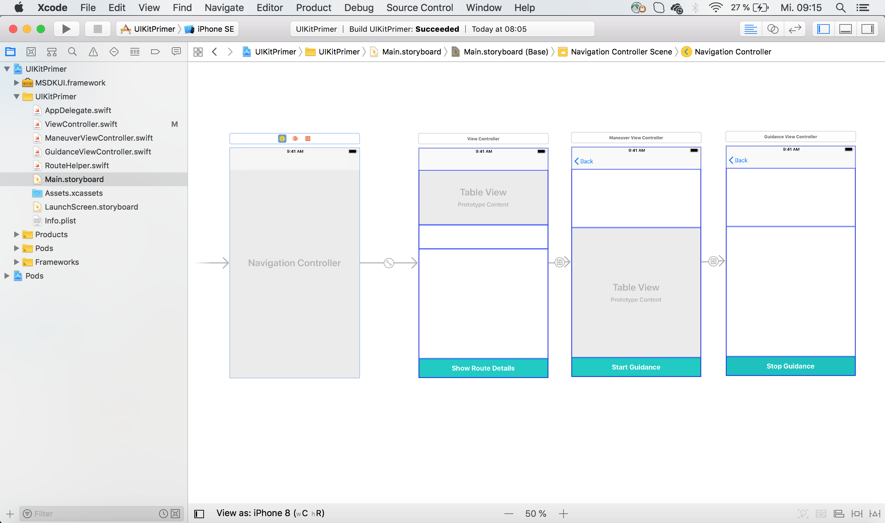
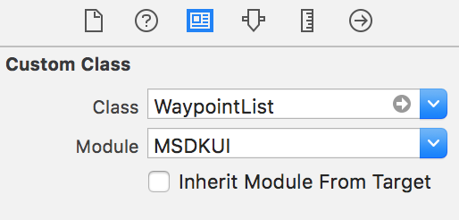
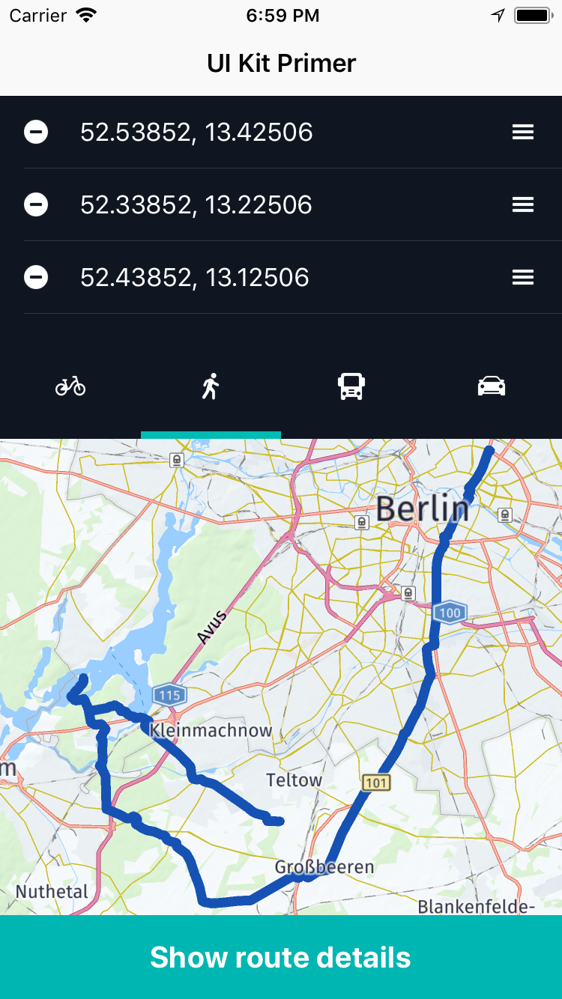
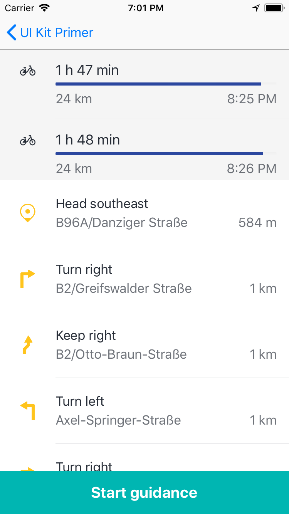
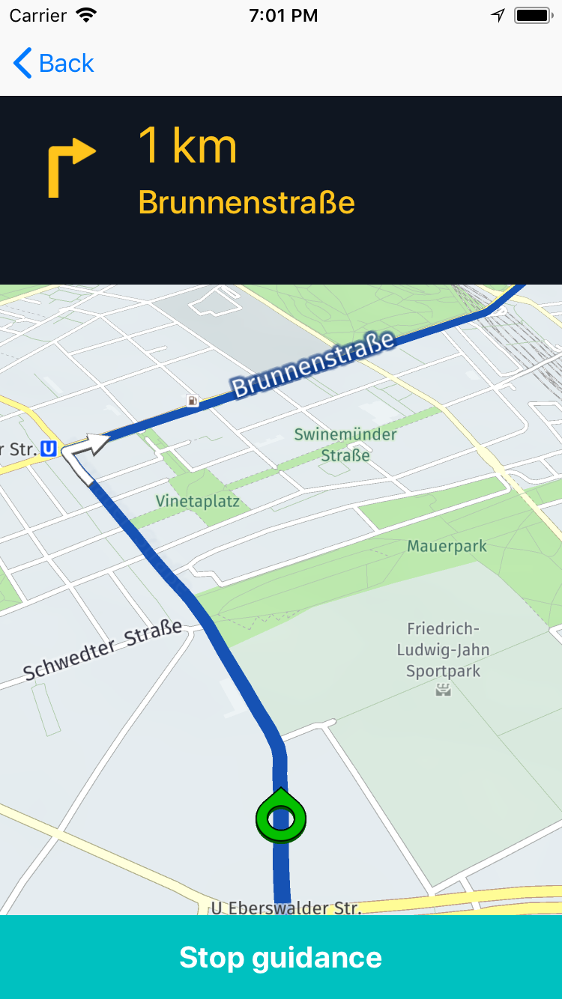
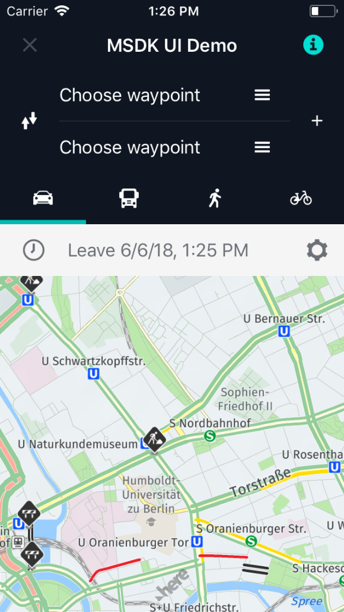
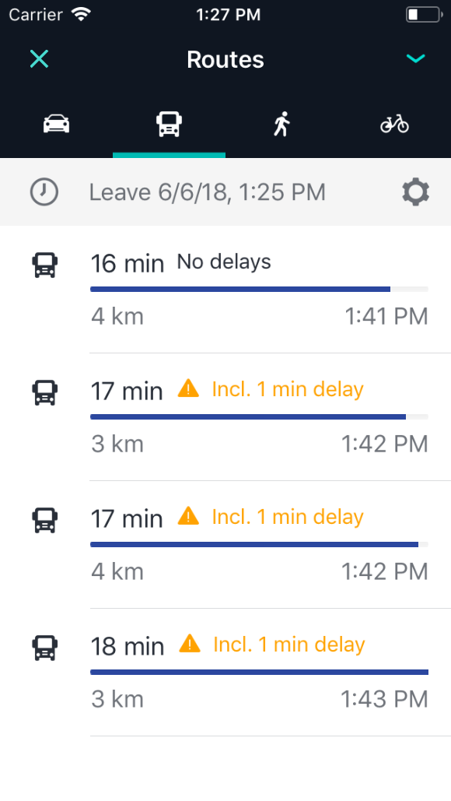
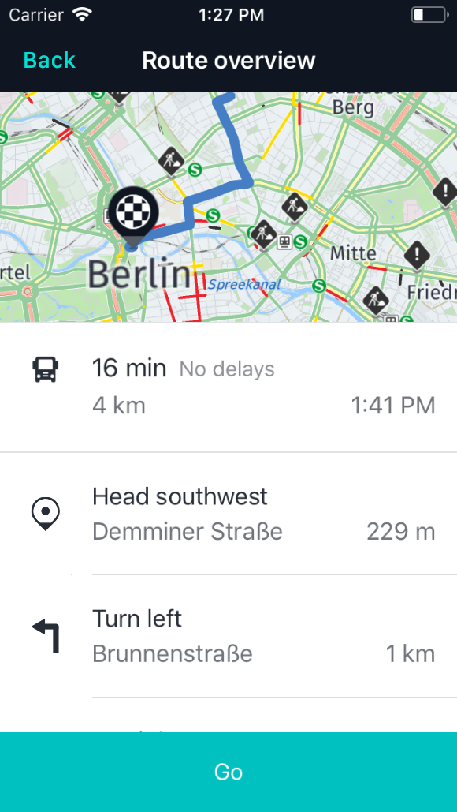

# HERE Mobile SDK UI Kit (MSDKUI) - User Guide

Are you looking for a framework that lets you build feature-rich and compelling user interfaces on top of the HERE Mobile SDK, _Premium_ Edition? Then the HERE Mobile SDK UI Kit (MSDKUI) for iOS and Android is the perfect companion for you.

This user guide describes the general workflow using the HERE Mobile SDK UI Kit (MSDKUI) and its components in detail. If you are looking for a quick overview, please look at our [README](../../README.md), our [Quick Start](QuickStart.md) guide or the latest _Release Notes_.

## Contents

- [Why use the HERE Mobile SDK UI Kit (MSDKUI)?](#why-use-the-here-mobile-sdk-ui-kit-msdkui)
- [Where to start?](#where-to-start)
- [How to read this guide?](#how-to-read-this-guide)
- [Getting Started - A HERE Mobile SDK UI Kit (MSDKUI) Primer](#getting-started---a-here-mobile-sdk-ui-kit-msdkui-primer)
- [Overview of the HERE Mobile SDK UI Kit (MSDKUI) Primer example](#overview-of-the-here-mobile-sdk-ui-kit-msdkui-primer-example)
- [Designing the app flow](#designing-the-app-flow)
- [Adding the HERE Mobile SDK UI Kit (MSDKUI) components](#adding-the-here-mobile-sdk-ui-kit-msdkui-components)
  - [Adding the map view](#adding-the-map-view)
- [Using the WaypointList](#using-the-waypointlist)
  - [Adding custom styles](#adding-custom-styles)
  - [Calculating the route](#calculating-the-route)
- [Using the TransportModePanel](#using-the-transportmodepanel)
- [Implementing the route details screen](#implementing-the-route-details-screen)
- [Using the RouteDescriptionList](#using-the-routedescriptionlist)
- [Implementing the guidance screen](#implementing-the-guidance-screen)
- [Using the GuidanceManeuverView](#using-the-guidancemaneuverview)
- [How to localize your app?](#how-to-localize-your-app)
- [Where to go from here?](#where-to-go-from-here)

## Why use the HERE Mobile SDK UI Kit (MSDKUI)?

The HERE Mobile SDK UI Kit (MSDKUI) provides highly flexible and customizable User Interface building blocks that can be freely combined and arranged with your own UI components - with just a few lines of code.

The HERE Mobile SDK UI Kit (MSDKUI) builds upon optimized native platform code to fully support Xcode's _Interface Builder_ and Android Studio's _Layout Editor_ resulting in reduced development time and a faster time to market for your apps.

- **Cleaner code:** By using the HERE Mobile SDK UI Kit's (MSDKUI) already assembled modular high- and low-level components, you can easily decouple existing (or new) HERE Mobile SDK logic from your UI modules and other parts of your application.

- **Easy to learn:** Each prebuilt component allows for straight-forward customization, either by switching on/off a predefined set of styles or by customizing the views programmatically. As each component is based on platform code, it behaves exactly like you would expect from any other native UI component you may have already in use.

- **Flexible:** All HERE Mobile SDK UI Kit (MSDKUI) components can be independently integrated from each other - allowing extensible cutting-edge user interfaces. Imagine an interactive route summary mixed with customized planning options directly showing the route to your facility? Or presenting route maneuvers based on the user's traffic preference on the same view? No matter what kind of user flow you want to create, with the HERE Mobile SDK UI Kit (MSDKUI) it is now all in your hands - making the HERE Mobile SDK a more powerful development tool than ever before.

With the HERE Mobile SDK UI Kit (MSDKUI), realizing complete apps including comprehensive route planning and state-of-the-art guidance becomes a matter of minutes. While hiding the underlying complexity, you still have all the freedom you need to build unique and powerful apps - take a quick tour with our [HERE Mobile SDK UI Kit (MSDKUI) Primer](#getting-started---a-here-mobile-sdk-ui-kit-msdkui-primer) to see a practical example.

Version 2.x of the HERE Mobile SDK UI Kit (MSDKUI) mainly focuses on enabling user experiences related to route planning and guidance. The HERE Mobile SDK UI Kit (MSDKUI) components are available for iOS and Android, supporting Java and Kotlin on Android, and Swift on iOS.

## Where to start?

- If you haven't done so, please read our [Quick Start](QuickStart.md) guide to see how you can integrate the HERE Mobile SDK UI Kit (MSDKUI) into your own apps.
- Check the [API Reference](https://heremaps.github.io/msdkui-ios/) that can be also built locally using the command line, see the [Contribution Guide](ContributionGuide.md).
- You can also find:
  - Numerous [examples](../Guides_Examples/) accompanying this user guide.
  - A HERE MSDK UI [demo app](../../MSDKUI_Demo/) showcasing most features of the HERE Mobile SDK UI Kit (MSDKUI) in production-ready quality.
- Read the [HERE Mobile SDK UI Kit (MSDKUI) Primer](#getting-started---a-here-mobile-sdk-ui-kit-msdkui-primer) chapter of this user guide.

## How to read this guide?

In the following sections we will guide you through the most common usage scenarios and reveal tips and easy-to-understand guidelines to help you get the most out of using the HERE Mobile SDK UI Kit (MSDKUI) for iOS. All _main_ sections can be read independent from each other, so you can skip any section and dive straight into the topics you are most interested in.

>**Note:** All examples that are built as part of this user guide are optimized for the iPhone / portrait mode to keep the projects light weighted and focused. The HERE Mobile SDK UI Kit (MSDKUI) fully supports all iOS flavors in portrait _and_ landscape mode. Adapting user interfaces to all iOS flavors depends on your specific requirements - and taste - and is beyond the scope of this document. If supporting landscape requires specific attention or differs from standard iOS behavior, it is noted down - otherwise not.

All HERE Mobile SDK UI Kit (MSDKUI) components support initialization from storyboards or by code (programmatically). For most examples, we recommend using storyboards and Auto Layout. As you can use HERE Mobile SDK UI Kit (MSDKUI) components like any other 3rd party custom controls, the general workflow does not contain any specific treatment. If you are new to working with views and layouts under iOS, we recommend to read Apple's [Auto Layout Guide](https://developer.apple.com/library/archive/documentation/UserExperience/Conceptual/AutolayoutPG/index.html#//apple_ref/doc/uid/TP40010853-CH7-SW1).

## Getting Started - A HERE Mobile SDK UI Kit (MSDKUI) Primer

In this short tutorial, we are guiding you through your first application with the HERE Mobile SDK UI Kit (MSDKUI). We shall be creating a small route planning application and provide reusable code snippets and guidelines on how to avoid the most common pitfalls. The resulting app is kept as simple as possible - feel free to modify or to extend it based on your own taste and needs.

>**Note:** For integrating the HERE Mobile SDK UI Kit (MSDKUI) framework, please have a look at our [Quick Start](QuickStart.md) to safely guide you through the first steps.

You can find the complete example code of the _MSDKUIPrimer_ app in the [examples section](../Guides_Examples/). We recommend that you follow this tutorial step-by-step. However, if you get stuck or if you just want to inspect the resulting code of this tutorial, please refer to the app as a point of reference.

## Overview of the HERE Mobile SDK UI Kit (MSDKUI) Primer example

The HERE Mobile SDK UI Kit (MSDKUI) Primer example app consists of three screens illustrating some of the main HERE Mobile SDK UI Kit (MSDKUI) components _in action_:

**Main Screen** (`ViewController.swift`)

- Shows a programmatically pre-populated `WaypointList`.
- A `TransportModePanel` to select a transport mode and to trigger immediate route calculation.
- A `NMAMapView` to show the calculated route and zoom to selected waypoints.
- An `UIButton` to navigate to the next screen.

**Route Details Screen** (`ManeuverViewController.swift`)

- Contains a `RouteDescriptionList` to select a route (if more than one route was found).
- A `ManeuverTableView` to show the maneuvers of the selected route.
- An `UIButton` to navigate to the next screen.

**Guidance Screen** (`GuidanceViewController.swift`)

- Shows a `GuidanceManeuverView` to indicate the next maneuvers.
- A `NMAMapView` to show the current position and orientation on the map.
- An `UIButton` to stop guidance.

First we need to create a new Xcode project, integrate the HERE Mobile SDK and the HERE Mobile SDK UI Kit (MSDKUI). If you followed the [Quick Start](QuickStart.md) guide, you have already created a `ViewController` as the main entry point to your application. If you prefer, you can also integrate this example into an existing application. The following steps will remain the same.

>**Note:** In the [Quick Start](QuickStart.md) guide, we created a `WaypointList` programmatically. For this tutorial we will only instantiate views from Interface Builder using storyboards. If needed, remove the programmatically added `WaypointList` from your main `ViewController`. We will create a new `WaypointList` from storyboard in a minute.

## Designing the app flow

To keep things simple and to wire up all three screens without any additional code, we can embed the `ViewController.swift` in a _Navigation Controller_. This is just a recommendation. You can also choose alternative approaches, e.g. `UIButtons` that perform custom segues - if you prefer. If you've never used a navigation controller before, make sure to take a look at [developer.apple.com](https://developer.apple.com/documentation/UIKit/uinavigationcontroller) to familiarize yourself with the basic concepts.

To use a navigation controller in Xcode, open `Main.storyboard` (we assume this storyboard was already created for you by using a Xcode template) and select the layout representation of your `ViewController`. Then select _Editor_ => _Embed In_ => _Navigation Controler_.

Typically you want to create view controllers for the other two screens by dragging a `ViewController` view to the storyboard. Once you have added a `UIButton` to a `ViewController`, you can Control-drag it to the next screen: An "Action Segue" dialog will pop up where you can select "Show" - and that's it. All of the required navigation flow for this HERE Mobile SDK UI Kit (MSDKUI) Primer app can be easily set up this way. Since we use only two `UIButtons` for forward-navigation, you only need to perform these steps two times.



Please have a look at the screenshot that shows an example of how these screens could look like in Xcode's _Interface Builder_. Make sure to also create the source files for each `ViewController` and set them as property in the _Identity inspector_ ("Custom Class", select "Inherit Module From Target").

>**Note:** that these steps do not contain any HERE Mobile SDK UI Kit (MSDKUI) specific behavior. As always, there are many alternative approaches to work with _Interface Builder_. The HERE Mobile SDK UI Kit's (MSDKUI) components will smoothly fit into any workflow that you are used to.

## Adding the HERE Mobile SDK UI Kit (MSDKUI) components

Now let's add the first HERE Mobile SDK UI Kit (MSDKUI) components to our new project. As outlined before we want to show two HERE Mobile SDK UI Kit (MSDKUI) components on our main `ViewController`:

- `WaypointList`
- `TransportModePanel`

Since all HERE Mobile SDK UI Kit (MSDKUI) components are direct or indirect children of `UIView`, they behave like any other `UIView` component. However, they are custom controls and they are not part of Apple's object library.

For example, to add a `TransportModePanel` first add a `UIView` to your view controller layout and add all desired constraints. Then proceed with other `UIView` objects and plan the layout accordingly, optionally use `UIStackView` containers for easier grouping vertically or horizontally.

Then switch to _Identity Inspector_ and set _Class_ and _Module_ accordingly for the "Custom Class":

- Class: `TransportModePanel`
- Module: `MSDKUI`

In the case of `WaypointList`, you would set the class name to _WaypointList_.

<center><p>
  
</p></center>


Now you can Control-drag the components to your `ViewController` to create `IBOutlet` references for later use.

Make sure to import the HERE Mobile SDK UI Kit (MSDKUI) by setting `import MSDKUI` at the top of your class.

**Note:** It is a good habit to select the direct parent type when dragging a view to the layout. For example, `WaypointList` is of type `UITableView`, so preferably use `UITableView` instead of `UIView` in this case.

If you have successfully Control-dragged both views to the `ViewController`, it should look like below:

```swift
@IBOutlet weak var waypointList: WaypointList!
@IBOutlet weak var transportModePanel: TransportModePanel!
```

### Adding the map view

`NMAMapView` is part of the HERE Mobile SDK and it can be added to a `ViewController` as shown on [developer.here.com](https://developer.here.com/documentation/ios-premium/topics/app-simple-swift.html).
`NMAMapView`'s super-type is `UIView`, but it depends on the way you integrated the HERE Mobile SDK. Please, make sure to _not_ set the _Module_ type in the _Custom Class_ area of the _Identity Inspector_. In opposition, when manually integrating the HERE Mobile SDK UI Kit (MSDKUI), make sure to _always_ set the `Module`.

Open your `Main.storyboard` and select the main view (nested under `ViewController`). In the _Identity Inspector_, select `HEREMapView` from the list and set it as `Custom Class`. Now open the _Assistant Editor_ and Control-drag the map view to your `ViewController`. The outlet window will pop up and as name for it, type `mapView` and click `connect`. This will add the following line to your view controller:

```swift
@IBOutlet weak var mapView: NMAMapView!
```

If not done already, import the HERE Mobile SDK by adding `import NMAKit`. Now you have an `IBOutlet` accessible from your view controller which you can start to use.

## Using the WaypointList

Once the storyboard is set up, and we have an `IBOutlet` reference for our components at hand, we can start using them and attach the behavior we desire. For this tutorial, we want to add a few waypoints programmatically.

HERE Mobile SDK UI Kit (MSDKUI) provides the `WaypointEntry` class as a wrapper to allow modification of certain attributes, so that you can set - for example - street names for each waypoint instead of showing the raw coordinates. Please see the [Quick Start](QuickStart.md) guide for an example.

```swift
let startWaypoint = WaypointEntry(NMAWaypoint(
    geoCoordinates: NMAGeoCoordinates(latitude: 52.53852, longitude: 13.42506)))
let stopoverWaypoint1 = WaypointEntry(NMAWaypoint(
    geoCoordinates: NMAGeoCoordinates(latitude: 52.33852, longitude: 13.22506)))
let stopoverWaypoint2 = WaypointEntry(NMAWaypoint(
    geoCoordinates: NMAGeoCoordinates(latitude: 52.43852, longitude: 13.12506)))
let destinationWaypoint = WaypointEntry(NMAWaypoint(
    geoCoordinates: NMAGeoCoordinates(latitude: 52.37085, longitude: 13.27242)))
```

As a next step, we need to add the `WaypointEntry` objects to the `WaypointList` as an array. Since we added four waypoints, based on our layout only some may be visible, so the user may scroll through the list to see all waypoints.

```swift
waypointList.waypointEntries = [startWaypoint, stopoverWaypoint1, stopoverWaypoint2, destinationWaypoint]
```

Note that order matters, but don't worry, the `WaypointList` HERE Mobile SDK UI Kit (MSDKUI) component by default already provides drag handles to change the order afterwards.

However, we also want to get notified, whenever the user did any interaction with the `WaypointList`. Therefore our view controller can conform to the `WaypointListDelegate` protocol. It provides the following methods:

- `waypointList(_ list: WaypointList, didAdd entry: WaypointEntry, at index: Int)`: Occurs when a new waypoint was added programmatically.
- `waypointList(_ list: WaypointList, didSelect entry: WaypointEntry, at index: Int)`: Occurs when a user taps on a waypoint.
- `waypointList(_ list: WaypointList, didRemove entry: WaypointEntry, at index: Int)`: A waypoint was removed programmatically or via the minus button.
- `waypointList(_ list: WaypointList, didDragFrom from: Int, to: Int)`: A waypoint was dragged to a new position.
- `waypointList(_ list: WaypointList, didUpdate entry: WaypointEntry, at index: Int)`: The waypoint contents have been updated.

All methods are optional, so you need to implement only the ones you are interested in. By default the `WaypointList` component provides a UI that allows the user to:

- drag a waypoint via the drag handles on the right side
- remove a waypoint by clicking the minus button on the left side

Note that the minus buttons only appear when there are more than two waypoints available.

To start listening for the first events, we need to add a delegate:

```swift
waypointList.listDelegate = self
```

In this case our `ViewController` conforms to the `WaypointListDelegate` protocol, so the delegate is `self`. Then we can implement the desired methods:

```swift
func waypointList(_ list: WaypointList, didSelect entry: WaypointEntry, at index: Int) {
    print("entrySelected")
    mapView.zoomLevel = 14
    mapView.set(geoCenter: entry.waypoint.originalPosition, animation: NMAMapAnimation.bow)
}

func waypointList(_ list: WaypointList, didRemove entry: WaypointEntry, at index: Int) {
    print("entryRemoved")
    calculateRoutes()
}

func waypointList(_ list: WaypointList, didDragFrom from: Int, to: Int) {
    print("entryDragged")
    calculateRoutes()
}
```

We implemented three methods to implement the following behavior:

- when a waypoint is selected, we want to zoom to the waypoint's position and center the map on it
- when a waypoint is removed, we want to calculate a new route
- when a waypoint is dragged, we also want to calculate a new route

### Adding custom styles

To indicate that a waypoint was tapped, we tweak a little bit the default styles that are available for each HERE Mobile SDK UI Kit (MSDKUI) component. Each component provides properties to allow you to change the default styles at any time to achieve an immediate effect or to change the look-and-feel of a component on-the-fly.

```swift
waypointList.itemFlashColor = .lightGray
waypointList.itemFlashDuration = 0.1
```

By default, waypoints contained in a `WaypointList` do not provide visual feedback when being tapped - as it cannot be assumed that an implementation may want to react on a tap event. Therefore, you can set a flash color and a flash duration. In this case, we've set a very short flash duration of 0.1 seconds to visually indicate that a waypoint was tapped.

These are not the only customizations you can make to a HERE Mobile SDK UI Kit (MSDKUI) component. For example, the following properties can be used to set the `WaypointList` component style:

- `.itemBackgroundColor: UIColor`
- `.itemButtonBackgroundColor: UIColor`
- `.itemButtonsTintColor: UIColor`
- `.itemTextColor: UIColor`
- `.itemTextLeadingInset: CGFloat`
- `.itemFlashColor: UIColor`
- `.itemFlashDuration: TimeInterval`

### Calculating the route

Since we integrated a HERE map, we can easily show a new route on it. For route calculation, we use the HERE Mobile SDK's core router. If you are interested in the implementation details, please have a look at the example code. For the purpose of this guide, we only need to be aware that route calculation requires `NMAWaypoint` objects and a `NMARoutingMode` containing details about the desired route. For example, a travel date, route options or a transport mode. For the sake of simplicity, we only provide a transport mode option. The `NMAWaypoint` array can easily be retrieved like:

```swift
let myWaypoints = waypointList.waypoints
```

Note that we show a route on the map once route calculation is completed. In this example, we show only the first calculated route, if more routes could be found.

## Using the TransportModePanel

As mentioned in the previous section we want to calculate a route for a specific transportation mode. Therefore we have added the `TransportModePanel` HERE Mobile SDK UI Kit (MSDKUI) component. By default it shows all supported transportation modes:

- `NMATransportMode.car`
- `NMATransportMode.truck`
- `NMATransportMode.pedestrian`
- `NMATransportMode.bike`
- `NMATransportMode.scooter`

>**Note:** If you plan to add `NMATransportMode.scooter`, please, make sure to extend your HERE Mobile SDK license key - if not done already.

The `TransportModePanel` can be used to change the `NMARoutingMode` that can be used for route calculation.

```swift
var routingMode = NMARoutingMode()
routingMode.resultLimit = 5
```

First we create a `routingMode` variable and accept a maximum of 5 different route results. The `TransportModePanel` can be customized by setting the desired modes to the `transportModes` array. In the following code snippet, we change the default order to start with `bike` first and omit the `scooter` transport mode.

```swift
transportModePanel.transportModes = [.bike, .pedestrian, .truck, .car]
transportModePanel.transportMode = .car
```

By setting `transportModePanel.transportMode` you can define which button should be highlighted by default. In this case, we choose `car` to be used for route calculation.

Our `ViewController` should act as a delegate for the `TransportModePanel` to get notified when the transport mode was changed after the user tapped on a different mode in the panel:

```swift
transportModePanel.delegate = self
```

Finally, to adopt the `TransportModePanelDelegate` protocol, we need to implement the following requirement:

```swift
func transportModePanel(_ panel: TransportModePanel, didChangeTo mode: NMATransportMode) {
    print("Transport mode changed: new mode: \(mode.rawValue)")
    routingMode.transportMode = mode
    calculateRoutes()
}
```

As you can see, the required method provides the changed `NMATransportMode` that we can set to our `routingMode`, which will then be used to calculate a new route.

The screenshot shows how the updated main `ViewController` would look like on an iPhone SE.

<center><p>
  
</p></center>

## Implementing the route details screen

In the previous screen the user was able to calculate a route based on his or her waypoint selection and a suitable route mode. Now we want to show a summary of the routes found and their maneuvers on a new screen. As described above we will show this in the `ManeuverViewController` of our HERE Mobile SDK UI Kit (MSDKUI) Primer example app. The `ManeuverViewController` controller holds two HERE Mobile SDK UI Kit (MSDKUI) components:

- `RouteDescriptionList`: Shows all found routes as a summary in a scrollable list
- `ManeuverTableView`: Shows all maneuvers belonging to a route

First, we need to wire up our layout using _Interface Builder_ - once done, we can control drag the views to create the desired `IBOutlet` references:

```swift
@IBOutlet weak var routeDescriptionList: RouteDescriptionList!
@IBOutlet weak var maneuverTableView: ManeuverTableView!
```

For the sake of this example we show both components on one screen. You may look at our demo app for an alternative User Interface approach. Note that the HERE Mobile SDK UI Kit (MSDKUI) does not promote any specific flow how it's component must be arranged - it all depends on your specific needs and taste.

## Using the RouteDescriptionList

Firstly, we use the routes calculated from the previous screens and check if we have routes to show. As we have pre-filled the `WaypointList`, we most likely will have at least one route to show. If a route may not be found, for example, when crossing the ocean, you may want to let the `RouteDescriptionList` component indicate a localized message that _no routes_ are set:

```swift
routeDescriptionList.routes = []
```

>**Note:** that the appearing message does not promote any specific reason why there is no route - and by default, no routes are set to the component. It is a good habit to bring back the default state by setting an empty array once route calculation has failed.

If we have some routes to show, we can set them like:

```swift
routeDescriptionList.routes = RouteHelper.sharedInstance.lastCalculatedRoutes!
```

Note that we use a `RouteHelper` convenience class to access the last calculated routes. If you are interested in the implementation details, please have a look at the example code.

By default the `RouteDescriptionList` shows white `RouteDescriptionItems` on a white list background. We want to change that and specify a gray background color for the list:

```swift
routeDescriptionList.backgroundColor = UIColor(red: 0.93, green: 0.93, blue: 0.93, alpha: 1.0)
```

The `RouteDescriptionItem` to be displayed can be accessed via the `RouteDescriptionListDelegate`, which can be implemented like shown below:

```swift
func routeDescriptionList(_ list: RouteDescriptionList, willDisplay item: RouteDescriptionItem) {
    item.backgroundColor = UIColor(red: 0.96, green: 0.96, blue: 0.96, alpha: 1.0)
}

func routeDescriptionList(_ list: RouteDescriptionList, didSelect route: NMARoute, at index: Int) {
    print("Selected route at index: \(index)")
    maneuverTableView.route = route
}
```

The first method allows to set a custom color for a `RouteDescriptionItem`, the latter notifies once a user selects a route by tapping on an item.

Once our view controller class conforms to the delegate protocol, we have to make sure to start listening by setting `self` as delegate:

```swift
routeDescriptionList.listDelegate = self
```

As our goal is to select a route and to see all the maneuvers of that route, we have to set the selected route to the `maneuverTableView`. Since we receive the selected `NMARoute` from the protocol method (as shown above) we can set it as new `route` to the `route` property of `ManeuverTableView`:

```swift
maneuverTableView.route = route
```

<center><p>
  
</p></center>

Like for all HERE Mobile SDK UI Kit's (MSDKUI) list components, we can get notified once a user selects a specific maneuver by tapping on it. To react on this event, we need to conform to the `ManeuverTableViewDelegate` protocol and implement the required method:

```swift
maneuverTableView.maneuverTableViewDelegate = self

// ...

func maneuverTableView(_ tableView: ManeuverTableView, didSelect maneuver: NMAManeuver, at index: Int) {
    print("Selected maneuver \(maneuver.description)")
}
```

As you may have noticed from the previous screenshot, we've also customized the icon color to appear in sunny yellow. This can be achieved by implementing an optional method of the `ManeuverTableViewDelegate` protocol:

```swift
@objc public func maneuverTableView(_ tableView: MSDKUI.ManeuverTableView, willDisplay view: MSDKUI.ManeuverItemView) {
    view.iconTintColor = UIColor(red: 1.0, green: 0.77, blue: 0.11, alpha: 1.0)
}
```

Tip: Try to play around with other customizable properties.

## Implementing the guidance screen

To finish our quick overview, we want to use the selected route from the previous step to start guidance along that route. For this we only need one new HERE Mobile SDK UI Kit (MSDKUI) component:

- `GuidanceManeuverView`

Since the contents of the `GuidanceManeuverView` may vary in height, it is recommended to _not_ set a constrained height. Note that all guidance components wrap their content without an additional padding. This gives us more flexibility to customize the layout - for example, we can specify our own padding by adding the `GuidanceManeuverView` with the desired outer constraints as a child to a parent view.

In addition, we also want to show a map during guidance to let the user orientate where we currently are.

Once we have attached all needed views to our layout, we can Control-drag them to the `GuidanceViewController`:

```swift
@IBOutlet weak var guidanceManeuverView: GuidanceManeuverView!
@IBOutlet weak var mapView: NMAMapView!
```

## Using the GuidanceManeuverView

The `GuidanceManeuverView` is a view where information about the next maneuvers will appear. As with all HERE Mobile SDK UI Kit (MSDKUI) components, it is already configured, so you only need to pass in the desired state based on the provided `GuidanceManeuverData`.

Before we can retrieve that data, we need to create a new `GuidanceManeuverMonitor` instance to start listening:

```swift
guidanceManeuverMonitor = GuidanceManeuverMonitor(route: route!)
guidanceManeuverMonitor.delegate = self
```

This way, we can set the `route` that will be used for guidance. The `GuidanceManeuverMonitor` is then taking care of forwarding any navigation events to the delegate class - allowing us to intercept the current `GuidanceManeuverData`.

For this we need to implement the `GuidanceManeuverMonitorDelegate` which requires us to implement two methods:

```swift
func guidanceManeuverMonitor(_ monitor: GuidanceManeuverMonitor,
                             didUpdateData data: GuidanceManeuverData?) {
    print("data changed: \(String(describing: data))")
    if let maneuverData = data {
        guidanceManeuverView.state = .data(maneuverData)
    } else {
        guidanceManeuverView.state = .updating
    }
}

func guidanceManeuverMonitorDidReachDestination(_ monitor: GuidanceManeuverMonitor) {
    print("Destination reached.")
    guidanceManeuverView.tintColor = .colorAccentLight
    guidanceManeuverView.highlightManeuver = true
}
```

While the first method simply sets the desired state to the `GuidanceManeuverView`, the latter informs us when the user has finally reached the destination. In this case, we choose to highlight the last maneuver.

`data: GuidanceManeuverData?` is an _optional_ value. If it is `nil`, we set the `.updating`-state to show a loading state indicating that there is currently no data to show. If you want to change the default behavior, you can use a customized `GuidanceManeuverData` instance.

>Before starting the trip, no initial maneuver data may be present. In such a case, the view shows a suitable default instruction, like "Follow the route on the map", until the first maneuver data - whether `nil` or not - is provided.

Optionally, you can use the MSDKUI's `NavigationManagerDelegateDispatcher` to multicast the HERE SDK's navigation events to your controller. This way you can, for example, enable voice commands during navigation. Check the `GuidanceViewController` for an example on how to do this.

In order for our app to be able to use guidance we must use the device's `location-services` and add the following permissions to our `Info.plist`.

```xml
<key>UIRequiredDeviceCapabilities</key>
<array>
  <string>location-services</string>
  <string>armv7</string>
</array>
<key>NSLocationWhenInUseUsageDescription</key>
<string>Your location is required for guidance.</string>
```

You can open the `plist` file as source file to add the above, or edit the list items directly as property list. The `NSLocationWhenInUseUsageDescription` is just an example - you may want to adapt the description to your specific needs. In this case, we need it for guidance, so we add a suitable text.

>**Note:** During guidance it may be useful to [prevent the device's display from dimming](https://developer.apple.com/documentation/uikit/uiapplication/1623070-idletimerdisabled). It may therefore be recommended that the `UIApplication.shared.isIdleTimerDisabled` property be set to `true` before starting guidance - and back to `false` as soon as the destination is reached.

Now, we are ready to start guidance by calling the helper method `startGuidanceSimulation(route: route!)`.

>**Note:** You can use the HERE Mobile SDK to start _simulated_ guidance. For implementation details, please check the example's code. During the development phase, it is usually more convenient to simulate the navigation experience along the provided route - so that we can quickly see how the `GuidanceManeuverView` changes its content in real-time.

<center><p>
  
</p></center>

For this example we have customized the icon and text color by adjusting the following style:

```swift
guidanceManeuverView.foregroundColor = UIColor(red: 1.0, green: 0.77, blue: 0.11, alpha: 1.0)
```

Similar to other components there are many more style settings available to adjust the view.

## How to localize your app?

The HERE Mobile SDK UI Kit (MSDKUI) for iOS is already localized. Please check [here](../../README.md#localization) to verify what languages are available.

Within Xcode you have to add the desired languages you want to support. If the language is not yet supported, then the device will fallback to English. For example, Xcode 9 and Xcode 10 already support base internationalization.

- Verify that Xcode's base internationalization is activated: Select your project in Xcode's file navigator. Make sure the project and not the target is selected. You should see the checkbox labelled _Use Base Internationalization_. If it is not selected, please select it.
- With the `+/-` buttons above, you can add or remove supported languages for your app. Make sure the selected language will match the ones from the HERE Mobile SDK UI Kit (MSDKUI).
- Set a language on the device via the device's settings. Restart your app: The HERE Mobile SDK UI Kit (MSDKUI) components should be localized now.

Note that this procedure does not contain any HERE specific steps. It's just the standard way on iOS how to add localization to your app. Once the app is properly localized the HERE Mobile SDK UI Kit (MSDKUI) will recognize the language and display the current language, if available.

During navigation you can also localize the shown units in the `GuidanceManeuverView`. The view has a property `distanceFormatter` that allows to specify a [MeasurementFormatter](https://developer.apple.com/documentation/foundation/measurementformatter):

```swift
let measurementFormatter = MeasurementFormatter()
measurementFormatter.unitOptions = .providedUnit
measurementFormatter.unitStyle = .short
measurementFormatter.locale = Locale(identifier: "de_DE")
guidanceManeuverView.distanceFormatter = measurementFormatter
```

For this example we have set the locale identifier to German ("de_DE").

## Where to go from here?

Congratulations, by following this HERE Mobile SDK UI Kit (MSDKUI) Primer tutorial you have discovered the basic HERE Mobile SDK UI Kit (MSDKUI) components and how they can work together to build extremely powerful apps. Please take a look at the [API Reference](https://heremaps.github.io/msdkui-ios/) to learn more about the various HERE Mobile SDK UI Kit (MSDKUI) components.

There you can also find more example code, and our demo application that shows most of the available HERE Mobile SDK UI Kit (MSDKUI) components and capabilities.

|  |  |  |
|:---:|:---:|:---:|
| **Main Screen** | **Route Description Screen** | **Maneuver Screen** |

The screenshots above show the "MSDK UI Demo" app on an iPhone SE.

We are happy to hear your feedback. Please [contact us](https://developer.here.com/contact-us) for any questions, suggestions or improvements. Thank you for using the HERE Mobile SDK UI Kit (MSDKUI).
